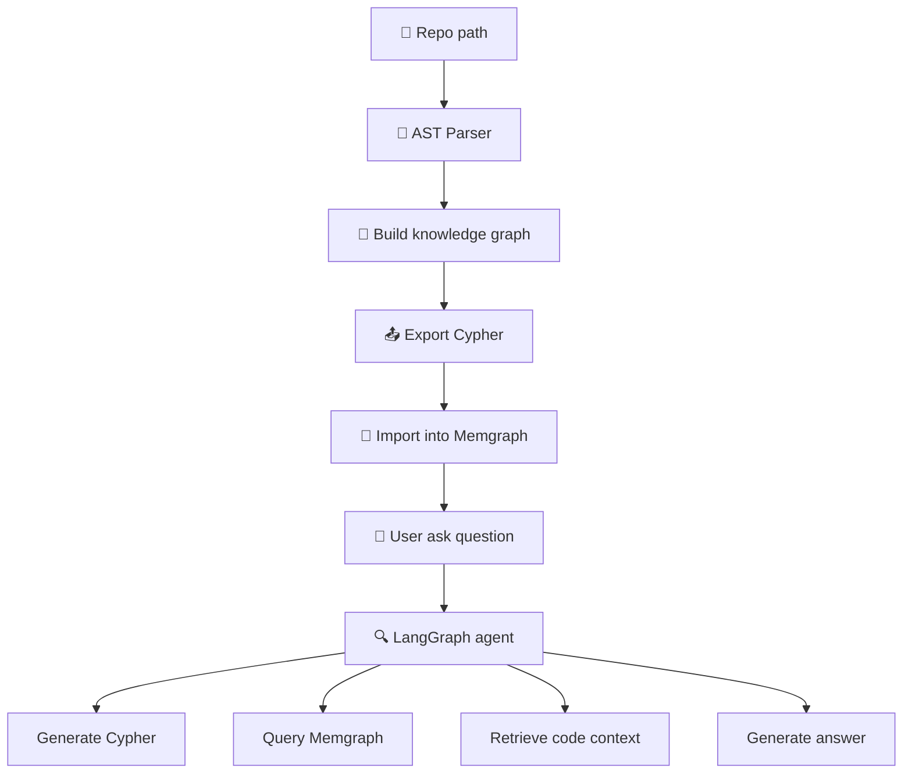

# 🧠 Overview: Graph-based RAG for Codebases

## 🔍 Goal

This project implements a **Retrieval-Augmented Generation (RAG)** system using **knowledge extracted from Python source code as a knowledge graph**. Users can ask **natural language questions** about the codebase and receive accurate answers related to structure, logic, and relationships within the source.

---

## 🧩 Overall Workflow




---

## ⚙️ Key Components

| Component                    | Description                                                              |
|-----------------------------|--------------------------------------------------------------------------|
| `ASTParser`                 | Parses Python code to extract Class, Function, Method, Calls, and Imports |
| `CodeGraphBuilder`          | Builds a graph representing source code structure                        |
| `export_to_cypher()`        | Converts the graph to Cypher statements for DB import                    |
| `build_knowledge_graph_and_insert_db()` | Full pipeline to parse and insert the graph into Memgraph       |
| `LangGraph Agent`           | NLQ → Cypher → Context → Answer generation pipeline                      |
| `Streamlit UI`              | Simple web interface to upload repo and query the graph                  |

---

## 🧱 Node Types

- `Project`, `Package`, `Folder`, `File`
- `Module`, `Class`, `Function`, `Method`
- `ExternalPackage` (imported libraries)

## 🔗 Relationship Types

- `CONTAINS_FOLDER`, `CONTAINS_FILE`, `CONTAINS_MODULE`, `CONTAINS_PACKAGE` : captures folder structure
- `DEFINES`, `DEFINES_METHOD`: entity definitions
- `CALLS`: function/method calls
- `DEPENDS_ON_EXTERNAL`: third-party dependencies

---

## 🤖 LangGraph Agent Pipeline

| Node              | Role                                                              |
|-------------------|-------------------------------------------------------------------|
| `UserQuestion`    | Receives user's natural language question                         |
| `GraphQuery`      | Uses LLM to generate Cypher query from the question               |
| `ContextRetrieval`| Executes the query against Memgraph to collect relevant context   |
| `AnswerGeneration`| Generates natural language answer based on question and context   |

---

## 🌐 Web UI Features

- Upload `.zip` file containing the repo
- Automatically run the pipeline: parse → build graph → export → import
- Display:
  - ✅ Final answer  
  - 🔍 Generated Cypher query  
  - 📚 Retrieved code snippets

---

## 📂 Project Structure

```
src/code_graph_rag/
├── utils/                          # File tools
│   └── file_utils.py
├── parser/                         # AST parser
│   └── ast_parser.py
├── graph/                          # Build & export graph
│   ├── graph_builder.py
│   └── exporter.py
├── pipeline/                       # Build & insert graph into DB
│   └── build_knowledge_graph.py
├── agent/                          # LangGraph-based agent
│   ├── graph_agent.py
│   ├── llm.py
│   └── utils/utils.py
└── ui/                             # Streamlit UI
    └── frontend.py
.env-example
docker-compose.yml
README.md
```