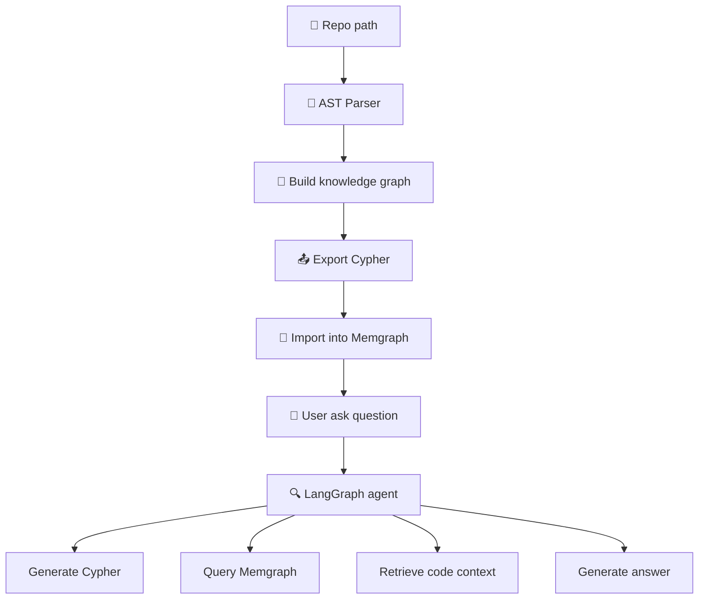

# 🧠 Overview: Graph-based RAG for Codebases

## 🔍 Goal

This project implements a **Retrieval-Augmented Generation (RAG)** system using **knowledge extracted from Python source code as a knowledge graph**. Users can ask **natural language questions** about the codebase and receive accurate answers related to structure, logic, and relationships within the source.

---

## 🧩 Overall Workflow




---

## ⚙️ Key Components

| Component                    | Description                                                              |
|-----------------------------|--------------------------------------------------------------------------|
| `ASTParser`                 | Parses Python code to extract Class, Function, Method, Calls, and Imports |
| `CodeGraphBuilder`          | Builds a graph representing source code structure                        |
| `export_to_cypher()`        | Converts the graph to Cypher statements for DB import                    |
| `build_knowledge_graph_and_insert_db()` | Full pipeline to parse and insert the graph into Memgraph       |
| `LangGraph Agent`           | NLQ → Cypher → Context → Answer generation pipeline                      |
| `Streamlit UI`              | Simple web interface to upload repo and query the graph                  |


---
---

## 🧱 Node Types

### **Structural Nodes** (File System Hierarchy)
| Node Type | Description | Identifier | Properties | Example |
|-----------|-------------|------------|------------|---------|
| `ProjectNode` | Root of the codebase/repository | `name` | `name: str` | `"myproject"` |
| `FolderNode` | Directory without `__init__.py` | `path` | `path: str, name: str` | `"src/utils"` |
| `PackageNode` | Directory with `__init__.py` | `qualified_name` | `qualified_name: str, name: str, path: str` | `"myproject.src.models"` |
| `FileNode` | Non-Python files | `path` | `path: str, name: str, extension: str` | `"README.md"` |
| `ModuleNode` | Python source files (`.py`) | `qualified_name` | `qualified_name: str, name: str, path: str` | `"myproject.src.models.user"` |

### **Code Definition Nodes** (Language Constructs)
| Node Type | Description | Identifier | Properties | Example |
|-----------|-------------|------------|------------|---------|
| `ClassNode` | Class definitions | `qualified_name` | `qualified_name: str, name: str, decorators: list[str], start_line: int, end_line: int, docstring: str \| None, parent: str \| None` | `"myproject.models.User"` |
| `FunctionNode` | Top-level or nested functions | `qualified_name` | `qualified_name: str, name: str, decorators: list[str], start_line: int, end_line: int, docstring: str \| None, is_anonymous: bool, parent: str \| None, signature: str \| None, parameters: list[str], return_type: str \| None` | `"myproject.utils.validate_email"` |
| `MethodNode` | Functions within classes | `qualified_name` | Inherits from `FunctionNode` + `parent: str` (class name) | `"myproject.models.User.get_name"` |
| `ExternalPackageNode` | Third-party dependencies | `name` | `name: str, version_spec: str` | `"requests>=2.25.0"` |


## 🔗 Relationship Types

### **Containment Relationships** (Structural Hierarchy)
| Relationship | Source Node(s) | Target Node | Description | Example |
|--------------|----------------|-------------|-------------|---------|
| `CONTAINS_FOLDER` | `Project`, `Folder`, `Package` | `Folder` | Directory contains subdirectory | `Project("myapp")` → `Folder("src")` |
| `CONTAINS_PACKAGE` | `Project`, `Folder`, `Package` | `Package` | Container holds Python package | `Folder("src")` → `Package("myapp.src.models")` |
| `CONTAINS_MODULE` | `Project`, `Folder`, `Package` | `Module` | Container holds Python file | `Package("myapp.src.models")` → `Module("myapp.src.models.user")` |
| `CONTAINS_FILE` | `Project`, `Folder`, `Package` | `File` | Container holds non-Python file | `Project("myapp")` → `File("README.md")` |

### **Definition Relationships** (Code Structure)
| Relationship | Source Node | Target Node(s) | Description | Example |
|--------------|-------------|----------------|-------------|---------|
| `DEFINES` | `Module`/ `Function` | `Class`, `Function` / `Function` | Module contains class or function definition | `Module("user")` → `Class("User")` |
| `DEFINES_METHOD` | `Class` | `Method` | Class contains method definition | `Class("User")` → `Method("get_name")` |

### **Behavioral Relationships** (Code Interactions)
| Relationship | Source Node(s) | Target Node(s) | Description | Properties | Example |
|--------------|----------------|----------------|-------------|------------|---------|
| `CALLS` | `Function`, `Method` | `Function`, `Method` | Function/method invocation | None | `Method("save")` → `Function("validate_data")` |
| `IMPORTS` | `Module` | `Module`, `ExternalPackage` | Import statement dependency | None | `Module("user")` → `Module("utils")` |
| `DEPENDS_ON_EXTERNAL` | `Project` | `ExternalPackage` | Third-party dependency usage | `version_spec: str` | `Project("myapp")` → `ExternalPackage("requests")` |

### **Inheritance Relationships** (OOP Structure)
| Relationship | Source Node | Target Node | Description | Example |
|--------------|-------------|-------------|-------------|---------|
| `INHERITS` | `Class` | `Class` | Class inheritance relationship | `Class("AdminUser")` → `Class("User")` |
| `OVERRIDES` | `Method` | `Method` | Method overriding in inheritance | `Method("AdminUser.save")` → `Method("User.save")` |

## 🎯 Identifier Strategy

| Node Type | Identifier | Reasoning |
|-----------|------------|-----------|
| **Project** | `name` | Simple project name for root reference |
| **Folder/File** | `path` | File system location is the natural identifier |
| **Package/Module** | `qualified_name` | Supports Python's import system and namespace resolution |
| **Class/Function/Method** | `qualified_name` | Enables precise code element referencing across modules |
| **ExternalPackage** | `name` | Package name as listed in dependency managers |

---

## 🤖 LangGraph Agent Pipeline

| Node              | Role                                                              |
|-------------------|-------------------------------------------------------------------|
| `UserQuestion`    | Receives user's natural language question                         |
| `GraphQuery`      | Uses LLM to generate Cypher query from the question               |
| `ContextRetrieval`| Executes the query against Memgraph to collect relevant context   |
| `AnswerGeneration`| Generates natural language answer based on question and context   |

---

## 🌐 Web UI Features

- Upload `.zip` file containing the repo
- Automatically run the pipeline: parse → build graph → export → import
- Display:
  - ✅ Final answer  
  - 🔍 Generated Cypher query  
  - 📚 Retrieved code snippets

---

## 📂 Project Structure

```
src/code_graph_rag/
├── utils/                          # File tools
│   └── file_utils.py
├── parser/                         # AST parser
│   └── ast_parser.py
|── models/                         # NodeTypes and RelationshipTypes
│   └── base.py
│   └── nodes.py
│   └── edges.py
├── graph/                          # Build & export graph
│   ├── graph_builder.py
│   └── exporter.py
├── pipeline/                       # Build & insert graph into DB
│   └── build_knowledge_graph.py
├── agent/                          # LangGraph-based agent
│   ├── graph_agent.py
│   ├── llm.py
│   └── utils/utils.py
└── ui/                             # Streamlit UI
    └── frontend.py
.env-example
docker-compose.yml
README.md
```